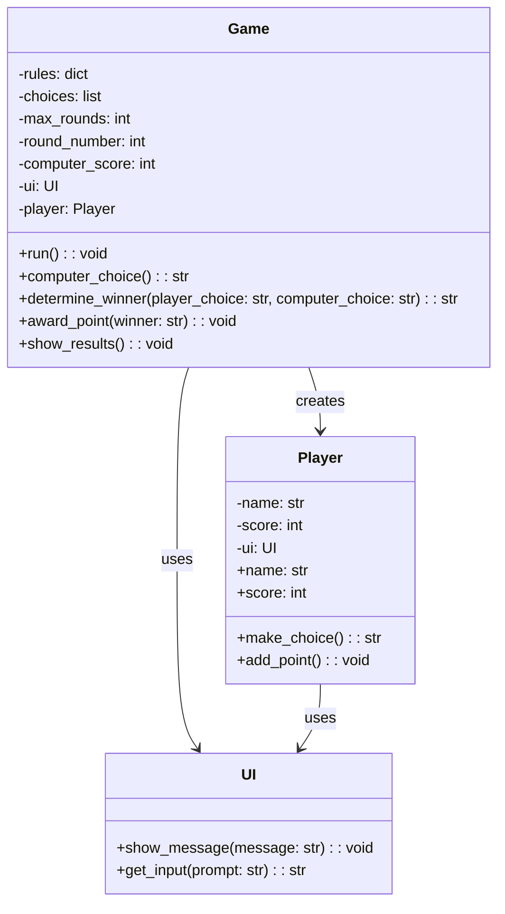

## 1. Есть ли у вас наследование
Нет

## 2. Есть ли композиция? Что чем владеет?
Композиция есть. Game создаёт Player
Game владеет rules, choices, max_rounds, round_number, computer_score, ui, player
Player владеет name, score, ui
UI не владеет ничем

## 3. Есть ли циклические зависимости?
Нет